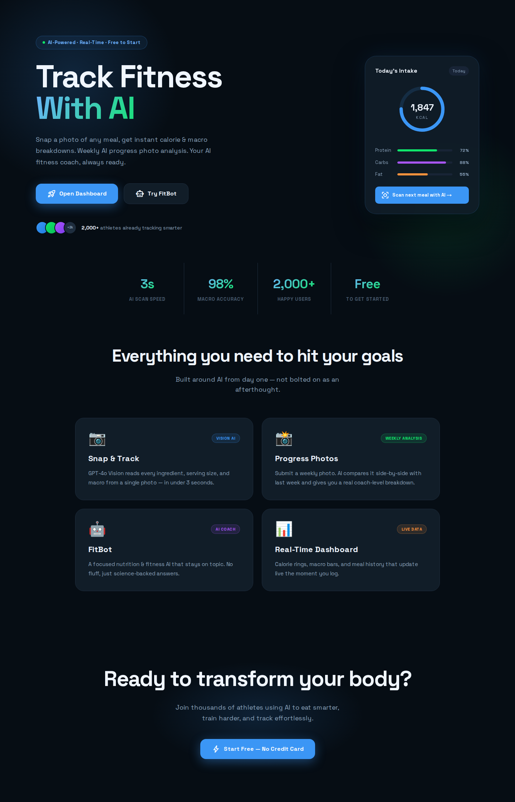
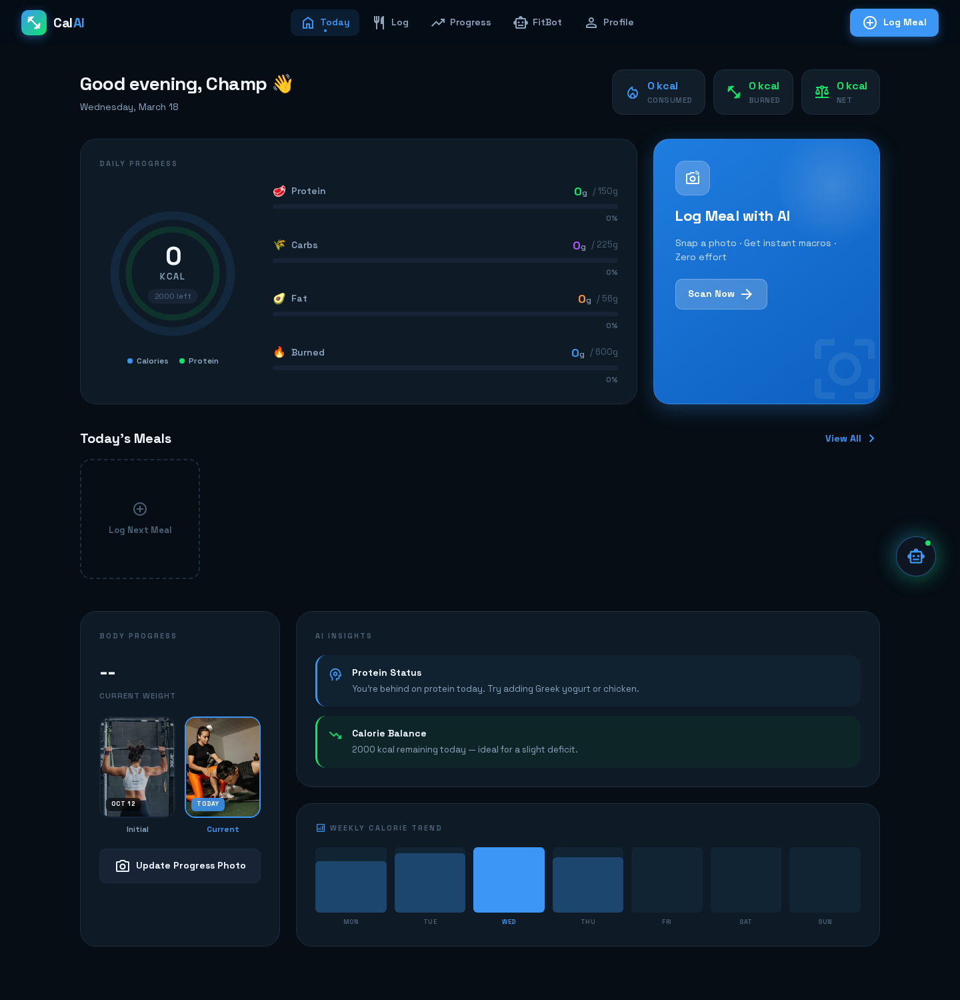

# Cal AI Clone 🥗🔥

> **An AI-powered nutrition & fitness tracker** — log meals with AI vision, track macros, chat with an AI coach, and monitor your progress. Built with a unified serverless backend (Convex), a cross-platform mobile app (Expo React Native), and a responsive web dashboard (Next.js 14).


---

## 📸 Previews

| Landing | Dashboard |
|---------|-----------|
|  |  |

---

## ✨ Features

| Feature | Description |
|---|---|
| 🍽️ **AI Meal Scanner** | Log breakfast, lunch, dinner & snacks by simply uploading a photo! Groq Vision (Llama-3.2) automatically extracts calories and macros (protein, carbs, fat). |
| 📊 **Live Dashboard** | Animated dual-ring progress chart showing calorie & protein targets in real time across all your devices. |
| 🤖 **FitBot AI Coach** | Chat with a fitness AI coach powered by **Groq** (Llama-3), seamlessly integrated within the app. |
| 📈 **Progress Tracker** | Daily macro snapshots, weekly check-ins with progress photos, and AI-generated analysis diffing your current week against the previous week. |
| 👤 **Profile & Goals** | Mifflin-St Jeor BMR calculator, personalized calorie/macro targets automatically synced from your profile. |
| 🔐 **Seamless Auth** | Secure authentication powered by **Clerk**, fully integrated across both Web and Mobile platforms. |
| 🌙 **Dark Premium UI** | Premium global dark theme with glassmorphism cards, animated blobs, and smooth transitions on all platforms. |

---

## 🏗️ Architecture (Monorepo)

```text
cal_ai_clone/
├── convex/          # The Convex backend (Serverless functions, DB schema, AI actions)
│   ├── schema.ts    # Centralized database schema (users, meals, dailySummaries, etc.)
│   ├── meals.ts     # Meal/Food functions and AI Actions
│   ├── checkins.ts  # Progress photo functions and AI Actions
│   └── chat.ts      # FitBot chat completion logic
├── mobile/          # Expo React Native App (iOS & Android)
│   ├── app/         # Expo Router structure (tabs, screens)
│   └── lib/         # Shared utilities, Convex configuration, Theme tokens
└── web/             # Next.js 14 Web App (App Router)
    ├── app/         # Next.js App Router structure (pages, layouts)
    └── components/  # React components
```

---

## 🛠️ Tech Stack

| Layer | Technology |
|---|---|
| **Web Frontend** | [Next.js 14](https://nextjs.org) (App Router, React server/client components) |
| **Mobile Frontend** | [Expo](https://expo.dev) / React Native (Expo Router) |
| **Database & Backend** | [Convex](https://convex.dev) — real-time database, serverless TypeScript functions & background actions |
| **Auth** | [Clerk](https://clerk.com) — seamlessly integrated across Next.js and Expo |
| **AI / Vision / Chat** | [Groq](https://groq.com) — handles meal scanning, progress diffing, and the FitBot coach via blazing fast Llama 3 models |
| **Language** | TypeScript (strict) |
| **Styling** | Web: CSS Modules (`.module.css`) / Mobile: React Native `StyleSheet` with shared design tokens |

---

## 🚀 Quick Start

### Prerequisites

- Node.js ≥ 18
- A [Convex](https://dashboard.convex.dev) account (free)
- A [Clerk](https://clerk.com) account (free)
- A [Groq](https://console.groq.com) API key (for blazing fast AI features)

### 1. Clone & Install

```bash
git clone https://github.com/your-username/cal_ai_clone.git
cd cal_ai_clone

# Install dependencies for each workspace
cd convex && npm install
cd ../web && npm install
cd ../mobile && npm install
```

### 2. Configure Environment Variables

Create `.env.local` files in the respective directories based on the providers:

**For Convex (`convex/.env`):**
```env
GROQ_API_KEY=gsk_...
```

**For Web (`web/.env.local`):**
```env
NEXT_PUBLIC_CONVEX_URL=https://your-deployment.convex.cloud
NEXT_PUBLIC_CLERK_PUBLISHABLE_KEY=pk_test_...
CLERK_SECRET_KEY=sk_test_...
```

**For Mobile (`mobile/.env`):**
```env
EXPO_PUBLIC_CONVEX_URL=https://your-deployment.convex.cloud
EXPO_PUBLIC_CLERK_PUBLISHABLE_KEY=pk_test_...
```

### 3. Initialize Backend (Convex)

```bash
cd convex
npx convex dev
# Follow the prompts to log in and create a new Convex project.
# This generates API types and deploys your schema and functions.
```

### 4. Start the Frontend Apps

**Run the Web App:**
```bash
cd web
npm run dev
# http://localhost:3000
```

**Run the Mobile App:**
```bash
cd mobile
npx expo start
# Scan the QR code with Expo Go on your phone or press 'i'/'a' for emulators.
```

---

## 🧠 Data Flow & AI

- **Real-time Sync:** Data lives in Convex. The `dailySummaries` automatically update via background mutations whenever a meal is added or deleted.
- **Secure AI Execution:** All Groq calls happen securely on the Convex backend via `action`s. API keys are never exposed to the Web or Mobile clients.
- **Vision:** Images (meals, progress photos) are uploaded to Convex Storage, and their secure URLs are passed to Groq for analysis.

---

## 📄 License

MIT © 2026
